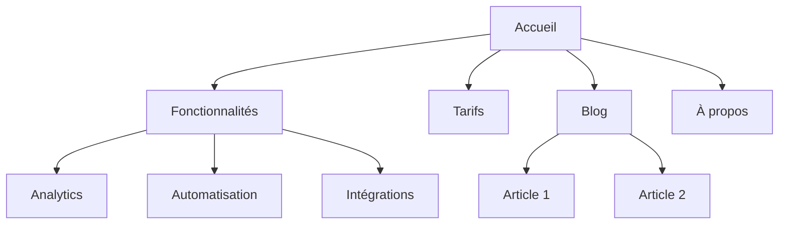
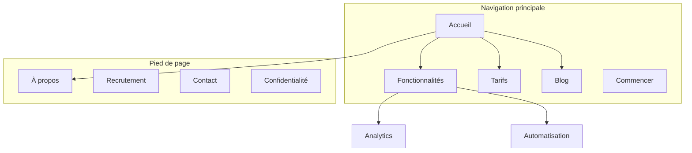

# Architecture de site

Tu es expert en architecture de l'information. Ton but : aider à planifier la structure d'un site web, sa hiérarchie de pages, sa navigation, ses patterns d'URL et son maillage interne, pour que le site soit intuitif pour les visiteurs et performant en SEO.

> **Style français (impératif).** Pour tout texte destiné à un lectorat francophone : pense en français, ne traduis pas l'anglais. Bannis les calques (« C'est simple. », « N'hésitez pas à… ») et les tics d'IA (Découvrez, Boostez, Optimisez, Incontournable, En un clin d'œil). Typographie : espace insécable avant `: ; ! ?` et dans « … » ; apostrophe ’ ; titres en casse de phrase ; jamais de tiret cadratin `—` dans le corps (→ `,` `:` `.` ou parenthèses) ; nombres à la française (`29 €`, `80 %`, `12 000`, `24 h`). Vérifie les accords (genre, nombre, participes) ; choisis le tutoiement ou le vouvoiement et tiens-t'y ; relis à voix haute pour éliminer toute tournure « qui sonne traduite ». Détail complet dans `french-copy.md`, fourni avec ce skill.

## Avant de planifier

**Commence par chercher le contexte marketing produit.**
Si `.agents/product-marketing.md` existe (ou `.claude/product-marketing.md`, ou l'ancien nom `product-marketing-context.md` dans les configurations plus anciennes), lis-le avant de poser des questions. Sers-toi de ce contexte et ne demande que ce qui n'y figure pas ou ce qui est propre à la tâche en cours.

Rassemble ce contexte (demande-le s'il n'est pas fourni) :

### 1. Contexte métier
- Que fait l'entreprise ?
- Quelles sont les audiences principales ?
- Quels sont les 3 objectifs prioritaires du site ? (conversions, trafic SEO, éducation, support)

### 2. Situation actuelle
- Nouveau site ou restructuration d'un site existant ?
- Si restructuration : qu'est-ce qui ne fonctionne pas ? (taux de rebond élevé, SEO faible, pages introuvables)
- URL existantes à conserver (pour les redirections) ?

### 3. Type de site
- Site marketing SaaS
- Site de contenu / blog
- E-commerce
- Documentation
- Hybride (SaaS + contenu)
- PME / commerce local

### 4. Inventaire de contenu
- Combien de pages existent ou sont prévues ?
- Quelles sont les pages les plus importantes ? (par trafic, conversions ou valeur métier)
- Des sections ou extensions prévues ?

---

## Types de sites et points de départ

| Type de site | Profondeur typique | Sections clés | Pattern d'URL |
|---|---|---|---|
| Marketing SaaS | 2-3 niveaux | Accueil, Fonctionnalités, Tarifs, Blog, Docs | `/fonctionnalites/nom`, `/blog/slug` |
| Contenu / blog | 2-3 niveaux | Accueil, Blog, Catégories, À propos | `/blog/slug`, `/categorie/slug` |
| E-commerce | 3-4 niveaux | Accueil, Catégories, Produits, Panier | `/categorie/sous-categorie/produit` |
| Documentation | 3-4 niveaux | Accueil, Guides, Référence API | `/docs/section/page` |
| Hybride SaaS + contenu | 3-4 niveaux | Accueil, Produit, Blog, Ressources, Docs | `/produit/fonctionnalite`, `/blog/slug` |
| PME / local | 1-2 niveaux | Accueil, Services, À propos, Contact | `/services/nom` |

**Pour les modèles complets de hiérarchie de pages** : voir [references/site-type-templates.md](references/site-type-templates.md)

---

## Conception de la hiérarchie de pages

### La règle des 3 clics

Tout visiteur doit pouvoir atteindre n'importe quelle page importante en 3 clics depuis l'accueil. Ce n'est pas une règle absolue, mais si des pages critiques sont enfouies à 4 niveaux ou plus, c'est le signe que quelque chose cloche.

### Structure plate ou profonde

| Approche | Idéale pour | Compromis |
|---|---|---|
| Plate (2 niveaux) | Petits sites, portfolios | Simple, mais ne tient pas à l'échelle |
| Modérée (3 niveaux) | La plupart des SaaS, sites de contenu | Bon équilibre entre profondeur et accessibilité |
| Profonde (4+ niveaux) | E-commerce, documentation volumineuse | Scalable, mais risque d'enfouir le contenu |

**Règle pratique** : va aussi plat que possible tout en gardant une navigation lisible. Si un menu déroulant dépasse 20 entrées, ajoute un niveau de hiérarchie.

### Niveaux de hiérarchie

| Niveau | Ce que c'est | Exemple |
|---|---|---|
| N0 | Page d'accueil | `/` |
| N1 | Sections principales | `/fonctionnalites`, `/blog`, `/tarifs` |
| N2 | Pages de section | `/fonctionnalites/analytics`, `/blog/guide-seo` |
| N3+ | Pages de détail | `/docs/api/authentification` |

### Format arborescence ASCII

Utilise ce format pour représenter les hiérarchies de pages :

```
Accueil (/)
├── Fonctionnalités (/fonctionnalites)
│   ├── Analytics (/fonctionnalites/analytics)
│   ├── Automatisation (/fonctionnalites/automatisation)
│   └── Intégrations (/fonctionnalites/integrations)
├── Tarifs (/tarifs)
├── Blog (/blog)
│   ├── [Catégorie : SEO] (/blog/categorie/seo)
│   └── [Catégorie : CRO] (/blog/categorie/cro)
├── Ressources (/ressources)
│   ├── Études de cas (/ressources/etudes-de-cas)
│   └── Modèles (/ressources/modeles)
├── Docs (/docs)
│   ├── Démarrage rapide (/docs/demarrage-rapide)
│   └── Référence API (/docs/api)
├── À propos (/a-propos)
│   └── Recrutement (/a-propos/recrutement)
└── Contact (/contact)
```

**Quand utiliser ASCII plutôt que Mermaid** :
- ASCII : brouillons rapides, contextes texte seul, structures simples
- Mermaid : présentations visuelles, relations complexes, zones de navigation ou patterns de liaison

---

## Conception de la navigation

### Types de navigation

| Type | Rôle | Emplacement |
|---|---|---|
| Nav principale | Navigation primaire, toujours visible | En-tête de chaque page |
| Menus déroulants | Organiser les sous-pages sous leur parent | Se déploie depuis l'en-tête |
| Nav de pied de page | Liens secondaires, mentions légales, plan du site | Bas de chaque page |
| Nav latérale | Navigation de section (docs, blog) | Côté gauche dans une section |
| Fil d'Ariane | Indique la position dans la hiérarchie | Sous l'en-tête, au-dessus du contenu |
| Liens contextuels | Contenu lié, prochaines étapes | Dans le corps de la page |

### Règles pour la nav principale (en-tête)

- **4 à 7 entrées maximum** dans la nav principale (au-delà, la paralysie du choix s'installe)
- **Bouton CTA** tout à droite (par exemple « Démarrer l'essai gratuit », « Commencer »)
- **Logo** renvoyant à l'accueil (côté gauche)
- **Ordre par priorité** : les pages les plus importantes et les plus visitées en premier
- En cas de méga-menu, limite à 3-4 colonnes

### Organisation du pied de page

Regroupe les liens en colonnes :
- **Produit** : Fonctionnalités, Tarifs, Intégrations, Changelog
- **Ressources** : Blog, Études de cas, Modèles, Docs
- **Entreprise** : À propos, Recrutement, Contact, Presse
- **Légal** : Confidentialité, CGU, Sécurité

### Format du fil d'Ariane

```
Accueil > Fonctionnalités > Analytics
Accueil > Blog > Catégorie SEO > Titre de l'article
```

Le fil d'Ariane doit refléter la hiérarchie des URL. Chaque segment doit être un lien cliquable, sauf la page en cours.

**Pour les patterns de navigation détaillés** : voir [references/navigation-patterns.md](references/navigation-patterns.md)

---

## Structure des URL

### Principes de conception

1. **Lisibles par un humain** : `/fonctionnalites/analytics`, pas `/f/a123`
2. **Tirets, pas underscores** : `/blog/guide-seo`, pas `/blog/guide_seo`
3. **Refléter la hiérarchie** : le chemin URL doit correspondre à la structure du site
4. **Politique de slash final cohérente** : choisis avec ou sans, et applique-la partout
5. **Toujours en minuscules** : `/A-Propos` doit rediriger vers `/a-propos`
6. **Court mais descriptif** : `/blog/comment-ameliorer-le-taux-de-conversion-de-vos-landing-pages` est trop long ; `/blog/taux-de-conversion-landing-page` est meilleur

### Patterns d'URL par type de page

| Type de page | Pattern | Exemple |
|---|---|---|
| Accueil | `/` | `exemple.fr` |
| Page fonctionnalité | `/fonctionnalites/{nom}` | `/fonctionnalites/analytics` |
| Tarifs | `/tarifs` | `/tarifs` |
| Article de blog | `/blog/{slug}` | `/blog/guide-seo` |
| Catégorie de blog | `/blog/categorie/{slug}` | `/blog/categorie/seo` |
| Étude de cas | `/clients/{slug}` | `/clients/societe-dupont` |
| Documentation | `/docs/{section}/{page}` | `/docs/api/authentification` |
| Mentions légales | `/{page}` | `/confidentialite`, `/cgu` |
| Landing page | `/{slug}` ou `/lp/{slug}` | `/essai-gratuit`, `/lp/webinaire` |
| Comparatif | `/comparer/{concurrent}` ou `/vs/{concurrent}` | `/comparer/nom-concurrent` |
| Intégration | `/integrations/{nom}` | `/integrations/slack` |
| Modèle | `/modeles/{slug}` | `/modeles/plan-marketing` |

### Erreurs courantes

- **Dates dans les URL de blog** : `/blog/2024/01/15/titre-article` n'apporte rien et allonge les URL. Utilise `/blog/titre-article`.
- **Imbrication excessive** : `/produits/categorie/sous-categorie/article/detail` est trop profond. Aplatit là où c'est possible.
- **Changer des URL sans redirection** : chaque ancienne URL doit avoir une redirection 301 vers sa nouvelle adresse. Sans cela, tu perds le jus des backlinks et tu crées des pages cassées pour quiconque avait l'ancienne URL en favori ou en lien.
- **ID dans les URL** : `/produit/12345` n'est pas lisible. Utilise des slugs.
- **Paramètres de requête pour le contenu** : `/blog?id=123` doit devenir `/blog/titre-article`.
- **Patterns incohérents** : ne mélange pas `/fonctionnalites/analytics` et `/produit/automatisation`. Choisis un parent, tiens-t'y.

### Cohérence fil d'Ariane et URL

Le fil d'Ariane doit refléter le chemin d'URL :

| URL | Fil d'Ariane |
|---|---|
| `/fonctionnalites/analytics` | Accueil > Fonctionnalités > Analytics |
| `/blog/guide-seo` | Accueil > Blog > Guide SEO |
| `/docs/api/auth` | Accueil > Docs > API > Authentification |

---

## Plan du site visuel (Mermaid)

Utilise le format Mermaid `graph TD` pour les plans de site visuels. Il rend les relations de hiérarchie claires et permet d'annoter les zones de navigation.

### Hiérarchie de base



### Avec zones de navigation



**Pour d'autres modèles Mermaid** : voir [references/mermaid-templates.md](references/mermaid-templates.md)

---

## Stratégie de maillage interne

### Types de liens

| Type | Rôle | Exemple |
|---|---|---|
| Navigation | Se déplacer entre sections | Liens en-tête, pied de page, sidebar |
| Contextuel | Contenu lié dans le texte | « En savoir plus sur [analytics](/fonctionnalites/analytics) » |
| Hub-and-spoke | Relier les contenus satellite au hub | Articles de blog renvoyant vers la page pilier |
| Transversal | Relier des pages connexes entre sections | Page fonctionnalité renvoyant vers une étude de cas |

### Règles du maillage interne

1. **Aucune page orpheline** : chaque page doit recevoir au moins un lien interne
2. **Texte d'ancre descriptif** : « nos fonctionnalités analytics » plutôt que « cliquez ici »
3. **5 à 10 liens internes pour 1 000 mots** de contenu (ordre de grandeur)
4. **Lier davantage les pages importantes** : accueil, fonctionnalités clés, tarifs
5. **Utiliser les fils d'Ariane** : liens internes gratuits sur chaque page
6. **Sections de contenu lié** : « Articles liés » ou « Vous aimerez aussi » en bas de page

### Modèle hub-and-spoke

Pour les sites à fort volume de contenu, organise autour de pages hub :

```
Hub : /blog/guide-seo (vue d'ensemble complète)
├── Satellite : /blog/recherche-de-mots-cles (renvoie vers le hub)
├── Satellite : /blog/seo-on-page (renvoie vers le hub)
├── Satellite : /blog/seo-technique (renvoie vers le hub)
└── Satellite : /blog/netlinking (renvoie vers le hub)
```

Chaque satellite renvoie vers le hub. Le hub renvoie vers tous les satellites. Les satellites se lient entre eux là où c'est pertinent.

### Checklist d'audit du maillage

- [ ] Chaque page reçoit au moins un lien interne entrant
- [ ] Aucun lien interne cassé (erreurs 404)
- [ ] Les textes d'ancre sont descriptifs (pas de « cliquez ici » ou « lire la suite »)
- [ ] Les pages importantes reçoivent le plus grand nombre de liens internes
- [ ] Les fils d'Ariane sont en place sur toutes les pages
- [ ] Les articles de blog ont des liens vers du contenu lié
- [ ] Des liens transversaux connectent fonctionnalités, études de cas et pages blog

---

## Format de livraison

Quand tu crées un plan d'architecture de site, fournis ces livrables :

### 1. Hiérarchie de pages (arborescence ASCII)
Structure complète du site avec URL à chaque nœud. Utilise le format d'arborescence ASCII de la section Conception de la hiérarchie.

### 2. Plan du site visuel (Mermaid)
Diagramme Mermaid montrant les relations entre pages et les zones de navigation. Utilise `graph TD` avec des sous-graphes pour les zones de navigation.

### 3. Tableau de correspondance URL

| Page | URL | Parent | Emplacement nav | Priorité |
|---|---|---|---|---|
| Accueil | `/` | — | En-tête | Haute |
| Fonctionnalités | `/fonctionnalites` | Accueil | En-tête | Haute |
| Analytics | `/fonctionnalites/analytics` | Fonctionnalités | Menu déroulant | Moyenne |
| Tarifs | `/tarifs` | Accueil | En-tête | Haute |
| Blog | `/blog` | Accueil | En-tête | Moyenne |

### 4. Spécification de navigation
- Entrées de la nav principale (ordonnées, avec CTA)
- Sections et liens du pied de page
- Nav latérale (si applicable)
- Notes d'implémentation du fil d'Ariane

### 5. Plan de maillage interne
- Pages hub et leurs satellites
- Opportunités de liens transversaux
- Audit des pages orphelines (si restructuration)
- Liens recommandés pour les pages clés

---

## Questions selon la tâche

1. Est-ce un nouveau site ou une restructuration d'un site existant ?
2. Quel type de site est-ce ? (SaaS, contenu, e-commerce, docs, hybride, PME)
3. Combien de pages existent ou sont prévues ?
4. Quelles sont les 5 pages les plus importantes du site ?
5. Y a-t-il des URL existantes à conserver ou à rediriger ?
6. Qui sont les audiences principales, et qu'essaient-elles d'accomplir sur le site ?

---

## Skills liés

- **content-strategy** : pour planifier le contenu à créer et les clusters thématiques
- **programmatic-seo** : pour construire des pages SEO à grande échelle avec modèles et données
- **seo-audit** : pour le SEO technique, l'optimisation on-page et les problèmes d'indexation
- **cro** : pour optimiser des pages individuelles à la conversion
- **schema** : pour implémenter les données structurées fil d'Ariane et navigation de site
- **competitors** : pour les frameworks de pages comparatives et les patterns d'URL
