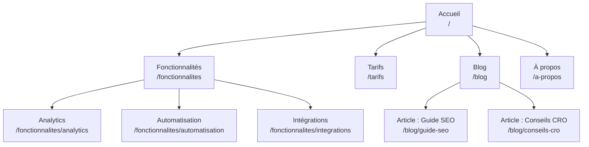
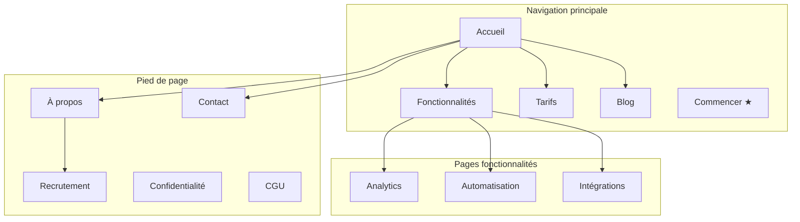
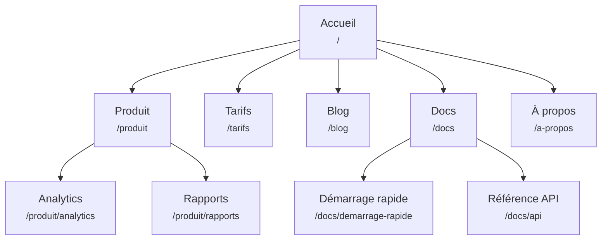
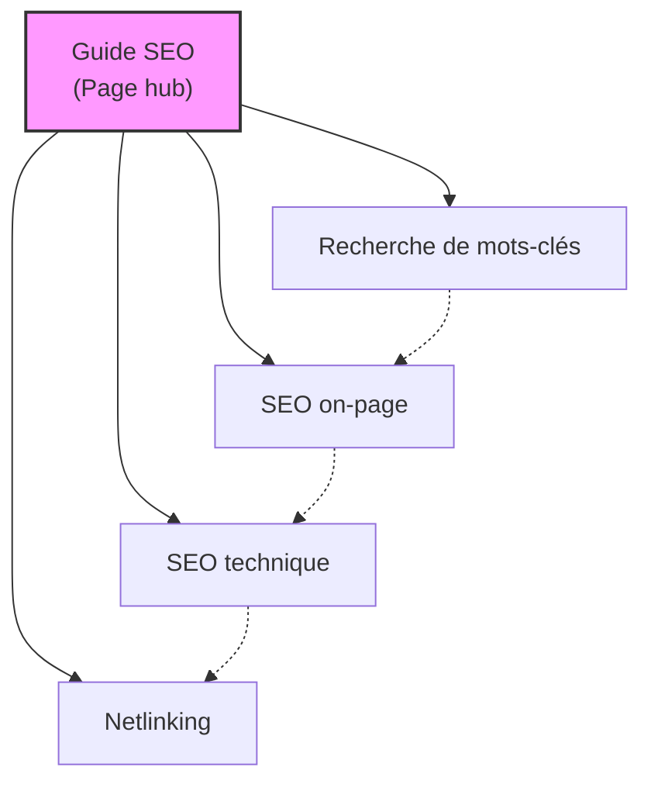
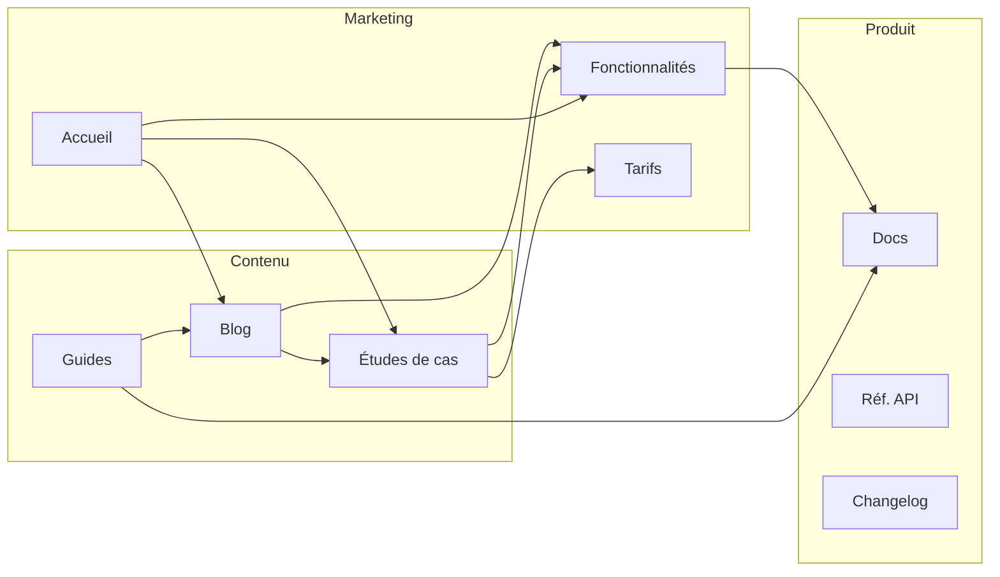
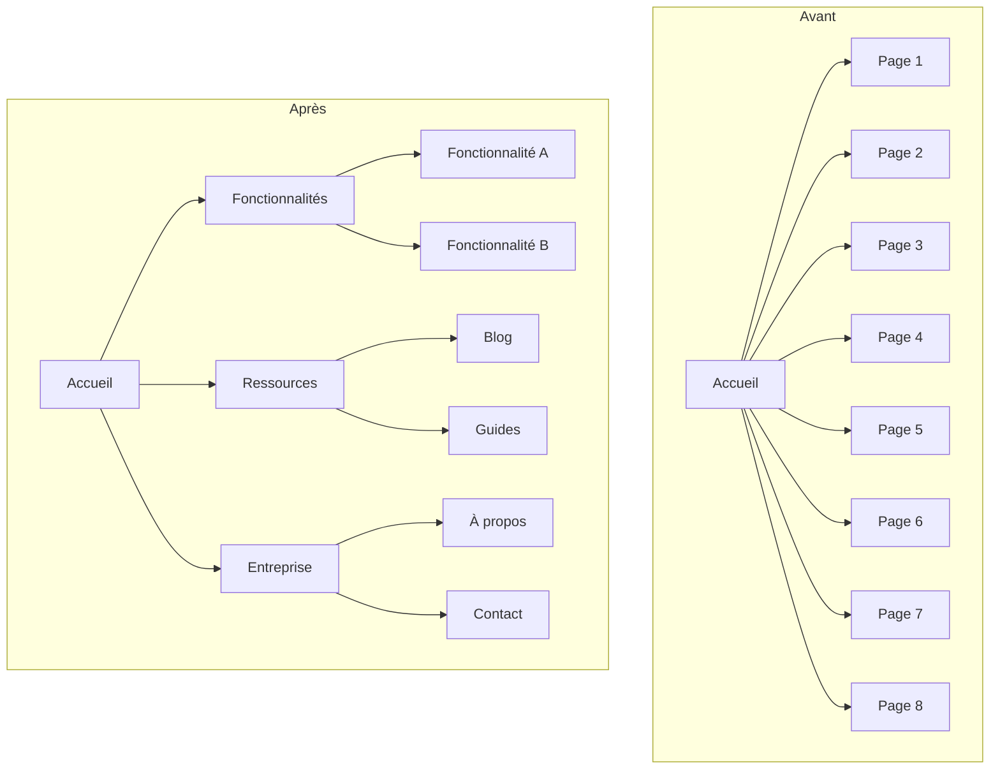
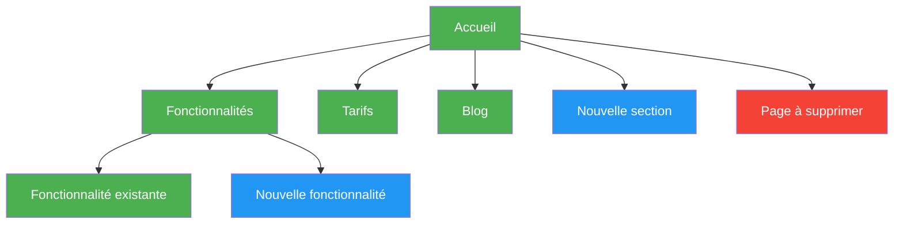

# Modèles de diagrammes Mermaid

Modèles Mermaid prêts à l'emploi pour les plans de site visuels. Adapte les libellés des nœuds et les connexions à ton site.

---

## Hiérarchie de base

Hiérarchie de pages simple du haut vers le bas.

---

## Hiérarchie avec zones de navigation

Utilise des sous-graphes pour montrer quelles pages apparaissent dans quelle zone de navigation.

---

## Hiérarchie avec libellés d'URL

Chaque nœud affiche le nom de la page et son chemin URL.

---

## Modèle hub-and-spoke

Montre une page hub reliée à ses articles satellites, avec des liens croisés entre satellites.

Légende :
- Traits pleins = liens hub-satellite principaux
- Traits pointillés = liens croisés entre satellites

---

## Flux de maillage interne

Montre comment les différentes sections du site se lient entre elles.

---

## Avant / après restructuration

Compare les structures actuelle et proposée côte à côte.

---

## Code couleur

Utilise des styles pour mettre en évidence le statut, la priorité ou le type des pages.

Code couleur :
- **Vert** (`#4CAF50`) : pages existantes (aucune modification)
- **Bleu** (`#2196F3`) : nouvelles pages à créer
- **Rouge** (`#f44336`) : pages à supprimer ou à rediriger
- **Jaune** (`#FFC107`) : pages à restructurer ou à déplacer
- **Violet** (`#9C27B0`) : pages prioritaires / CTA
